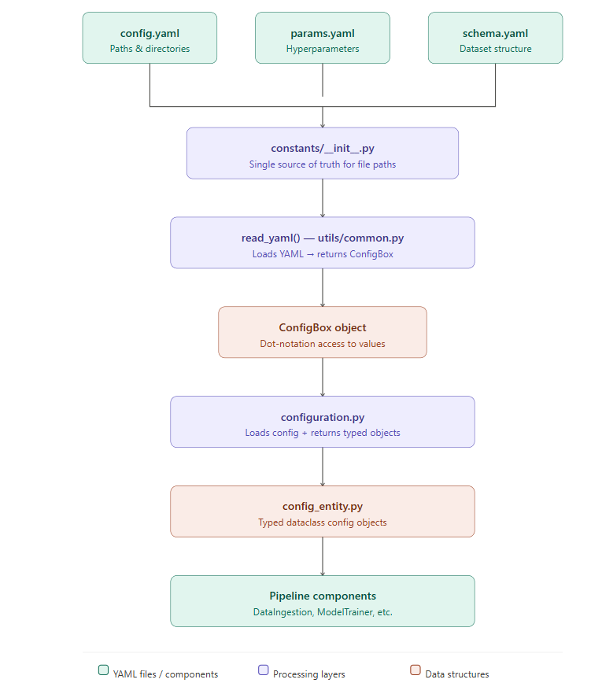

# credit_card_fraud_detection
## Web_app: https://credit-card-fraud-detection-web.onrender.com
"please wait for some to load because it is the free version"
## End to End Data Science Project

### Workflows--ML Pipeline

1. Data Ingestion
2. Data Validation
3. Data Transformation-- Feature Engineering,Data Preprocessing
4. Model Trainer
5. Model Evaluation- MLFLOW,Dagshub

### Workflows

1. Update config.yaml
2. Update schema.yaml
3. Update params.yaml
4. Update the entity
5. Update the configuration manager in src config
6. Update the components
7. Update the pipeline 
8. Update the main.py

# ML Pipeline Configuration Workflow (README Guide)

## Overview

Modern machine learning pipeline projects use a structured configuration workflow to manage:

* config.yaml
* params.yaml
* schema.yaml

These files store settings separately from code, making projects cleaner, reproducible, and production-ready.

This README explains the **complete configuration workflow architecture** used in modular ML pipelines.

---

# Why Configuration Files Are Used

Instead of writing values inside Python scripts:

```
learning_rate = 0.01
file_path = "data/train.csv"
```

we store them inside YAML files:

```
config.yaml
params.yaml
schema.yaml
```

Benefits:

* easier experiment tracking
* reusable pipelines
* cleaner project structure
* faster debugging
* production-ready setup

---

# Role of Each YAML File

## config.yaml

Stores **file paths and directory structure**

Example:

```yaml
artifacts_root: artifacts

data_ingestion:
  root_dir: artifacts/data_ingestion
  source_URL: https://example.com/data.zip
  local_data_file: artifacts/data_ingestion/data.zip
  unzip_dir: artifacts/data_ingestion
```

Used for:

* dataset locations
* artifact folders
* output directories

## params.yaml

Stores **model hyperparameters**

Example:

```yaml
learning_rate: 0.01
batch_size: 32
epochs: 50
```

Used for:

* training parameters
* tuning experiments
* reproducibility

## schema.yaml

Stores **dataset structure information**

Example:

```yaml
columns:
  age: int
  salary: float
  fraud: int
```

Used for:

* validation rules
* column checking
* preventing data drift

---

# Why Store YAML Paths in constants/**init**.py

Example:

```
src/project/constants/__init__.py
```

Example code:

```python
from pathlib import Path

CONFIG_FILE_PATH = Path("config/config.yaml")
PARAMS_FILE_PATH = Path("params.yaml")
SCHEMA_FILE_PATH = Path("schema.yaml")
```

Why this is important:

Advantages:

* avoids hardcoding paths everywhere
* single source of truth
* easier refactoring
* safer imports across modules

Example usage:

```python
from project.constants import CONFIG_FILE_PATH

config = read_yaml(CONFIG_FILE_PATH)
```

---

# Complete Configuration Workflow Architecture

Typical pipeline flow:

```
YAML Files
   ↓
constants/__init__.py
   ↓
read_yaml() utility
   ↓
ConfigBox object
   ↓
configuration.py
   ↓
config_entity.py (dataclass objects)
   ↓
pipeline components
```

Each layer has a specific responsibility.

<p align="center">
  
</p>

---

# Step 1: constants/**init**.py

Stores file paths

```python
from pathlib import Path

CONFIG_FILE_PATH = Path("config/config.yaml")
PARAMS_FILE_PATH = Path("params.yaml")
SCHEMA_FILE_PATH = Path("schema.yaml")
```

This ensures paths remain consistent.

---

# Step 2: read_yaml() Utility Function

Located inside:

```
utils/common.py
```

Example:

```python
from ensure import ensure_annotations
from box import ConfigBox
from pathlib import Path
import yaml


@ensure_annotations

def read_yaml(path_to_yaml: Path) -> ConfigBox:

    with open(path_to_yaml) as yaml_file:

        content = yaml.safe_load(yaml_file)

        return ConfigBox(content)
```

Purpose:

* loads YAML
* converts dictionary → ConfigBox
* enables dot notation access

Example:

```
config.data_ingestion.root_dir
```

---

# Step 3: configuration.py

Reads YAML and prepares configuration objects

Location:

```
config/configuration.py
```

Example:

```python
from project.constants import CONFIG_FILE_PATH
from project.utils.common import read_yaml


class ConfigurationManager:

    def __init__(self):

        self.config = read_yaml(CONFIG_FILE_PATH)
```

Purpose:

Central configuration loader

---

# Step 4: config_entity.py (Using dataclass)

Creates structured configuration objects

Example:

```python
from dataclasses import dataclass
from pathlib import Path


@dataclass
class DataIngestionConfig:

    root_dir: Path

    source_URL: str

    local_data_file: Path

    unzip_dir: Path
```

Why this matters:

Advantages:

* structured configs
* type-safe values
* clean pipeline communication

---

# Step 5: configuration.py Returns Dataclass Objects

Example:

```python
from project.entity.config_entity import DataIngestionConfig


def get_data_ingestion_config(self):

    config = self.config.data_ingestion

    return DataIngestionConfig(

        root_dir=config.root_dir,

        source_URL=config.source_URL,

        local_data_file=config.local_data_file,

        unzip_dir=config.unzip_dir

    )
```

Purpose:

Convert YAML values → structured dataclass object

---

# Step 6: Pipeline Component Uses Config Object

Example:

```
components/data_ingestion.py
```

Example:

```python
class DataIngestion:

    def __init__(self, config: DataIngestionConfig):

        self.config = config
```

Usage:

```
self.config.root_dir
```

Cleaner than dictionary access.

---

# Why ensure_annotations Is Used

Example:

```
@ensure_annotations
```

Purpose:

Ensures function arguments match expected types

Example:

```
read_yaml("config.yaml") ❌

read_yaml(Path("config.yaml")) ✅
```

Prevents runtime bugs.

---

# Why ConfigBox Is Used

Converts:

```
dictionary → dot-access object
```

Example:

Instead of:

```
config["data_ingestion"]["root_dir"]
```

We use:

```
config.data_ingestion.root_dir
```

Cleaner and safer.

---

# Why dataclass Is Used

Creates structured configuration containers

Example:

```
DataIngestionConfig
ModelTrainerConfig
DataValidationConfig
```

Benefits:

* readable
* immutable (optional)
* type-safe
* pipeline-friendly

---

# Final Workflow Summary

Complete architecture:

```
constants/__init__.py
        ↓
read_yaml()
        ↓
ConfigBox
        ↓
configuration.py
        ↓
config_entity.py (dataclass)
        ↓
pipeline components
```

This structure is used in professional ML pipeline repositories because it keeps configuration:

* centralized
* readable
* reusable
* scalable
* production-ready

---

# Why This Architecture Is Industry Standard

Because it supports:

* experiment reproducibility
* modular pipelines
* clean configuration management
* large team collaboration
* deployment-ready ML systems

This workflow is commonly used in end-to-end machine learning projects such as fraud detection pipelines.


# Render Deployment Guide - Credit Card Fraud Detection

## Overview

This guide explains how to deploy the FastAPI and Flask services to Render with proper environment variables and secret management.

---

## Step 1: GitHub Repository Secrets Setup And Below Username's And Keys Are Not Real Including Below Links Expect Offical Links 

GitHub Secrets are encrypted and used by CI/CD pipeline to authenticate with Docker Hub and Render.

### Add GitHub Secrets

Go to your GitHub repository:
1. Settings → Secrets and variables → Actions
2. Click "New repository secret"

Add these secrets:

| Secret Name | Value | Where to Get It |
|---|---|---|
| `DOCKERHUB_USERNAME` | `<user_name>` | Your Docker Hub account name |
| `DOCKERHUB_PASSWORD` | `dckr_pat_xxxx` | Docker Hub → Account Settings → Security → New Access Token |
| `RENDER_API_KEY` | `rnd_xxxx` | Render Dashboard → Account (bottom left) → API Keys → Create new |
| `RENDER_SERVICE_ID_FASTAPI` | `srv_xxxxx` | Your FastAPI service ID from Render |
| `RENDER_SERVICE_ID_FLASK` | `srv_xxxxx` | Your Flask service ID from Render |

---

## Step 2: Create Docker Hub Access Token

### Why? 
GitHub Actions needs to authenticate with Docker Hub to push images. Using a token is safer than using your password.

### How to Create:

1. Go to [Docker Hub](https://hub.docker.com) and sign in
2. Click your avatar → Account Settings
3. Left sidebar → Security → New Access Token
4. Name it: `github-actions-fraud-detection`
5. Read & Write permissions
6. Copy the token and save as `DOCKERHUB_PASSWORD` in GitHub

---

## Step 3: Get Render API Key

### Why?
The CI/CD pipeline uses this to trigger automatic deployments after pushing to Docker Hub.

### How to Get:

1. Go to [Render Dashboard](https://dashboard.render.com)
2. Click your avatar at bottom left → Account Settings
3. Scroll to "API Keys"
4. Click "Create new API key"
5. Copy and save as `RENDER_API_KEY` in GitHub Secrets

---

## Step 4: Create Two Render Web Services

You need **two separate services**: one for FastAPI, one for Flask.

### Service 1: FastAPI Backend

1. **Render Dashboard** → New → Web Service
2. **Configuration:**
   - **Name**: `fraud-detection-api`
   - **Environment**: Docker
   - **Repository**: (select your repo)
   - **Branch**: `main`
   - **Dockerfile**: `fastapi_app/Dockerfile`
   - **Region**: Choose your region
   - **Plan**: Free or Starter
3. Click "Create Web Service"

**After Creation:**
- Copy the **Service ID** from URL: `https://dashboard.render.com/services/srv_xxxxx`
- Save as `RENDER_SERVICE_ID_FASTAPI` in GitHub Secrets

### Service 2: Flask Frontend

1. **Render Dashboard** → New → Web Service
2. **Configuration:**
   - **Name**: `fraud-detection-web`
   - **Environment**: Docker
   - **Repository**: (same repo)
   - **Branch**: `main`
   - **Dockerfile**: `flask_app/Dockerfile`
   - **Region**: Same as FastAPI
   - **Plan**: Free or Starter
3. Click "Create Web Service"

**After Creation:**
- Copy the **Service ID** from URL
- Save as `RENDER_SERVICE_ID_FLASK` in GitHub Secrets

---

## Step 5: Configure Environment Variables in Render

Each service needs environment variables. Set them in Render Dashboard.

### FastAPI Service Environment

Click your FastAPI service → Settings → Environment tab

Add:
```
PYTHONUNBUFFERED=1
MLFLOW_TRACKING_URI=https://dagshub.com/<user_name>/<project_name>.mlflow
MLFLOW_TRACKING_USERNAME=<uesr_name>
MLFLOW_TRACKING_PASSWORD=..........
```

### Flask Service Environment

Click your Flask service → Settings → Environment tab

Add:
```
PYTHONUNBUFFERED=1
FASTAPI_URL=https://fraud-detection-api.onrender.com/predict
PORT=5000
```

**Important:**
- Replace `fraud-detection-api.onrender.com` with your actual FastAPI URL from Render
- Get the correct URL: Your FastAPI service page shows it

---

## Step 6: Add Service URLs to Render

### Find Your Service URL

For each service in Render Dashboard:
- Click on the service
- Top of page shows: `https://your-service-name.onrender.com`

### Update Flask Service

After FastAPI is deployed:

1. Click Flask service → Settings → Environment
2. Update `FASTAPI_URL`:
   ```
   FASTAPI_URL=https://your-fastapi-service.onrender.com/predict
   ```
3. Click "Save changes"
4. Service auto-redeploys

---

## Step 7: Deploy Manually (First Time)

First deployment might need to be triggered manually:

1. Go to your FastAPI service in Render
2. Click "Manual Deploy" → "Deploy latest commit"
3. Wait for build to complete (check logs)
4. Do the same for Flask service

---

## Step 8: Verify Deployments

### Check FastAPI Health

```bash
curl https://your-fastapi-service.onrender.com/
# Response: {"message": "Fraud Detection API running successfully 🚀"}
```

### Check FastAPI Docs

Open in browser:
```
https://your-fastapi-service.onrender.com/docs
```

### Check Flask UI

Open in browser:
```
https://your-flask-service.onrender.com/
```

### Check Logs

In Render Dashboard:
- Click service → Logs
- See all recent logs including errors

---

## Step 9: Automatic Deployments

After GitHub Secrets are set up, CI/CD pipeline auto-deploys:

1. Push code to `main` branch
2. GitHub Actions builds Docker images
3. Images pushed to Docker Hub
4. CI/CD calls Render API to trigger redeploy
5. Render pulls new images from Docker Hub
6. Services restart automatically

---

## How the Workflow Works

```
┌─────────────────────────────────────────┐
│  You: git push to main branch           │
└────────────────┬────────────────────────┘
                 │
                 ▼
┌─────────────────────────────────────────┐
│  GitHub Actions Triggered               │
│  - Build FastAPI Docker image           │
│  - Build Flask Docker image             │
│  - Push both to Docker Hub              │
└────────────────┬────────────────────────┘
                 │
                 ▼
┌─────────────────────────────────────────┐
│  CI/CD calls Render API                 │
│  - trigger FastAPI service redeploy     │
│  - trigger Flask service redeploy       │
└────────────────┬────────────────────────┘
                 │
                 ▼
┌─────────────────────────────────────────┐
│  Render pulls new images from Docker Hub│
│  Restarts services with new code        │
└────────────────┬────────────────────────┘
                 │
                 ▼
┌─────────────────────────────────────────┐
│  ✅ Services live at:                  │
│  FastAPI: https://your-api.onrender.com│
│  Flask:   https://your-web.onrender.com│
└─────────────────────────────────────────┘
```

---

## Troubleshooting

### "Service failed to start"

Check logs in Render Dashboard:
1. Click service → Logs
2. Look for error messages
3. Common issues:
   - Missing environment variables
   - Port not accessible
   - MLflow connection error (fallback to local model)

### "Cannot connect to FastAPI from Flask"

1. Verify `FASTAPI_URL` in Flask service environment
2. Use full URL: `https://your-fastapi-service.onrender.com`
3. NOT `http://127.0.0.1` (doesn't work on Render)

### "Deployment not triggering"

1. Check GitHub Secrets are correct
2. Verify `RENDER_API_KEY` works:
   ```bash
   curl https://api.render.com/v1/services \
     -H "Authorization: Bearer YOUR_API_KEY"
   ```
3. Verify service IDs are correct:
   ```bash
   echo $RENDER_SERVICE_ID_FASTAPI
   ```

### "Docker Hub authentication failed"

1. Verify `DOCKERHUB_USERNAME` and `DOCKERHUB_PASSWORD` in GitHub Secrets
2. Test Docker login locally:
   ```bash
   docker login -u <user_name> -p <DOCKERHUB_PASSWORD>
   ```

---

## Key Environment Variables Reference

| Variable | FastAPI | Flask | Purpose |
|---|---|---|---|
| `PYTHONUNBUFFERED` | ✅ | ✅ | Real-time console output |
| `FASTAPI_URL` | ❌ | ✅ | URL to reach FastAPI service |
| `PORT` | ❌ | ✅ | Flask port (5000) |
| `MLFLOW_TRACKING_URI` | ✅ | ❌ | MLflow model registry URL |
| `MLFLOW_TRACKING_USERNAME` | ✅ | ❌ | MLflow credentials |
| `MLFLOW_TRACKING_PASSWORD` | ✅ | ❌ | MLflow credentials |

---

## GitHub Secrets Quick Reference

Store these in GitHub (Settings → Secrets):

```yaml
DOCKERHUB_USERNAME: <user_name>
DOCKERHUB_PASSWORD: dckr_pat_xxxx  # From Docker Hub
RENDER_API_KEY: rnd_xxxx  # From Render Account settings
RENDER_SERVICE_ID_FASTAPI: srv_xxxxx  # From FastAPI service URL
RENDER_SERVICE_ID_FLASK: srv_xxxxx  # From Flask service URL
```

---

## Quick Checklist

- [ ] Created Docker Hub access token
- [ ] Created Render API key
- [ ] Added 5 GitHub Secrets
- [ ] Created FastAPI service on Render
- [ ] Created Flask service on Render
- [ ] Added environment variables to FastAPI service
- [ ] Added environment variables to Flask service
- [ ] Updated Flask `FASTAPI_URL` with correct service URL
- [ ] Pushed to `main` branch and CI/CD triggered
- [ ] Verified services are running and accessible

---

## Support

If services don't deploy:

1. Check GitHub Actions logs (your repo → Actions tab)
2. Check Render service logs (Render Dashboard → Service → Logs)
3. Verify all environment variables are set correctly
4. Test Docker images locally first:
   ```bash
   docker compose up --build
   ```

